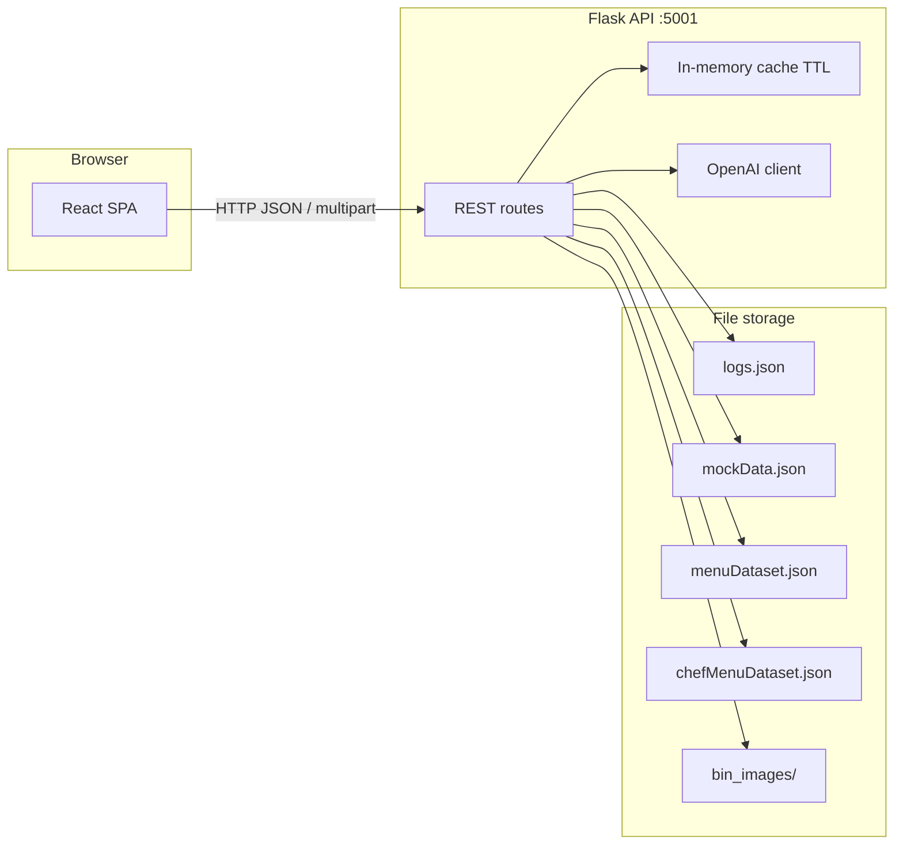

# HawkWaste

**AI-powered food waste intelligence for College Dining Services (IIT Commons) · IIT Hackathon 2026**

HawkWaste helps dining staff estimate waste from bin photos, view trends on a manager dashboard, and receive short AI recommendations. The system combines **OpenAI vision** for photo analysis, **structured JSON datasets** for menus and historical mock logs, and a **React** front end that talks to a **Flask** API.

---

## What it does

- **Log Waste** — Upload a photo of a waste bin; the API estimates fullness (%), estimated pounds, and confidence, then appends a record to `logs.json` (images saved under `backend/data/bin_images/`).
- **Dashboard** — Charts, KPIs, date filters, environmental impact, sustainability score, AI weekly tip, “today’s menu vs waste” cross-reference, and recent bin logs.
- **No traditional database** — All persistence is **JSON files** on disk (`logs.json`, `mockData.json`, `menuDataset.json`, `chefMenuDataset.json`). This keeps deployment simple and matches hackathon/demo needs.

---

## Tools and stack

| Layer | Technology |
|--------|------------|
| **Frontend** | React 18, React Router 6, Recharts, Create React App |
| **Backend** | Python 3, Flask 3, Flask-CORS |
| **AI** | OpenAI API (`gpt-4o-mini` for chat and vision on bin images) |
| **Config** | `python-dotenv` — loads `backend/.env` for `OPENAI_API_KEY` |
| **Production server** | Gunicorn (`Procfile` in `backend/`) |

---

## Architecture

High-level data flow:



**Separation of concerns**

1. **React app** (`frontend/`) — Routing (`/dashboard`, `/log`), fetches `REACT_APP_API_URL` (e.g. `http://localhost:5001`), renders charts and forms.
2. **Flask app** (`backend/app.py`) — Single module exposing REST endpoints; reads/writes JSON; calls OpenAI where needed; optional **in-memory cache** (short TTL) for expensive AI-backed responses (`/recommendation`, `/trend`).
3. **Datasets** (`backend/data/`) — Mock shift logs and week summary drive charts and menu cross-reference; `menuDataset.json` supplies AI context and historical waste metadata; `chefMenuDataset.json` supplies batch sizes for UI enrichment; `logs.json` holds user-uploaded bin events.

**Important behavior**

- **`/logs`** merges **photo logs** (`logs.json`) with **mock logs** (`mockData.json`) for the dashboard.
- **`/recommendation`** and **`/trend`** incorporate photo log totals where implemented and **invalidate cache** when a new photo is saved so the UI can refresh after uploads.
- **Sustainability score** (`/trend`) is derived from aggregated daily stats (mock + photo); the AI line in `/trend` is a separate short commentary from the model.

---

## Repository layout

```
hawkwaste/
├── backend/
│   ├── app.py              # Flask application and all routes
│   ├── requirements.txt
│   ├── Procfile            # gunicorn app:app
│   ├── .env                # local only — OPENAI_API_KEY (not in git)
│   ├── .env.sample         # template for env vars
│   └── data/
│       ├── logs.json       # append-only style photo/bin logs
│       ├── mockData.json   # synthetic weekly logs + weekSummary
│       ├── menuDataset.json
│       ├── chefMenuDataset.json
│       └── bin_images/     # saved uploads from /analyze-photo
├── frontend/
│   ├── package.json
│   ├── .env                # REACT_APP_API_URL (local dev)
│   ├── public/
│   └── src/
│       ├── index.js        # Router + Navbar + routes
│       ├── index.css
│       ├── components/
│       │   ├── Navbar.js
│       │   └── MenuCrossRef.js   # “Today’s menu vs waste scores”
│       └── pages/
│           ├── DashboardPage.js
│           └── LoggerPage.js
└── README.md
```

---

## API reference (backend)

| Method | Path | Purpose |
|--------|------|---------|
| GET | `/health` | Liveness / project metadata |
| POST | `/analyze-photo` | Multipart: `image`, `shift`, optional `date`, `disposal_method` → vision estimate + append to `logs.json` |
| GET | `/logs` | Photo logs, flattened item logs from mock, mock shift rows, `weekSummary` |
| GET | `/recommendation` | AI weekly tip + totals (mock + photo-aware); cached briefly |
| GET | `/trend` | Sustainability score, period comparison, item trajectories, AI commentary; cached briefly |
| GET | `/impact` | Environmental equivalents; `?scope=week` or shift/date or `?lbs=` |
| GET | `/menu` | Static station name list |
| GET | `/menu/today` | `?date=` / `?shift=` — menu vs waste for a logged day (mock + menu + chef datasets, fuzzy matching) |
| GET | `/predict` | `?shift=` — risk scoring + AI pre-shift warning from `menuDataset.json` |
| GET | `/chef/menu` | Chef menu JSON (optional `shift`) |
| POST | `/chef/compare` | JSON body: cooked vs actual waste comparison + AI insight |
| GET | `/batch-optimize` | `?shift=` — batch size suggestions from historical waste |

**Local dev port:** Flask runs on **5001** by default in `app.py` (avoids macOS AirPlay on 5000). Point the frontend at `http://localhost:5001`.

---

## Setup (local)

### Backend

```bash
cd backend
python -m venv .venv
source .venv/bin/activate   # Windows: .venv\Scripts\activate
pip install -r requirements.txt
cp .env.sample .env           # add OPENAI_API_KEY
python app.py
```

API base: `http://127.0.0.1:5001` — try `GET /health`.

### Frontend

```bash
cd frontend
npm install
# Set REACT_APP_API_URL=http://localhost:5001 in .env
npm start
```

App: `http://localhost:3000` (redirects to `/dashboard`).

---

## Deployment (summary)

- **Backend (e.g. Render):** Root `backend/`, set `OPENAI_API_KEY`, install deps, start with Gunicorn per `Procfile`.
- **Frontend (e.g. Vercel):** Root `frontend/`, set `REACT_APP_API_URL` to the deployed API URL, `npm run build`.

---

## The problem we solve

Many college dining especially IIT Commons lacks a lightweight way to tie **visual bin state** to **menu and waste patterns**. Paper logs are hard to aggregate. HawkWaste uses **one photo per bag change** on hardware staff already carry, with **under ~$10/month**-scale API cost versus enterprise hardware systems.

---

## License / notes

- Do not commit real API keys; use `.env` locally and platform secrets in production.
- `mockData.json` is the primary source for **demo charts** and **menu/today** dates; extend it or sync from real operations as the product matures.
